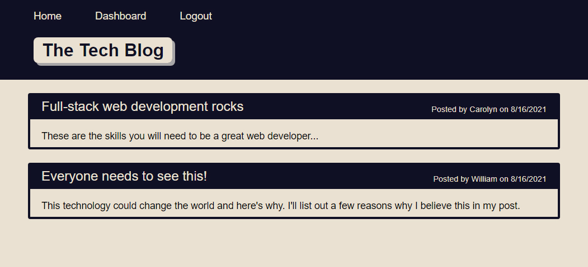

# Tech Blog Forum

[](https://opensource.org/licenses/MIT)

## Description
This full-stack web app was built as a blog/forum style site to host discussions on the latest in developer tech news and opinions. The website handles user account creation securely using bcrypt to hash passwords and once a user is validated they can interact with the forum by creating blog posts of their own or adding comments to past posts. User’s can also edit or delete their outdated blog posts on their personal dashboard page. Posts are displayed most recent to oldest on the homepage but each post’s thread of comments goes oldest to newest to follow the conversation smoothly.

This project was built with the MVC (Model-View-Controller) paradigm in mind to keep files and workflow organized. The database and models were built and accessed using MySQL2 and Sequelize. The client side was designed using the templating language Handlebars.js using a layout template, pages, and partials to render posts and comments consistently. Express.js handles the routing for rendering pages and API requests. I’ve also implemented express-session and connect-session-sequelize to set up user sessions and use cookies to keep the user logged in if they navigate away from the web app. The app is hosted live on Heroku.

## User Story/Goal
```
AS A developer who writes about tech
I WANT a CMS-style blog site
SO THAT I can publish articles, blog posts, and my thoughts and opinions
```

## Live Site

https://tech-blog-forum-mvc.herokuapp.com/



## Technologies
- MySQL2
- Sequelize
- Handlebars.js
- Express.js

#### Packages
- bcrypt
- dotenv
- express-handlebars
- express-session
- connect-session-sequelize

## Future Development
I will be revisiting this project in the future to expand upon the interactivity of the website and refine the overall graphic design/layout.

## License
Licensed under the MIT License - https://opensource.org/licenses/MIT

## Contributing
You are welcome to fork this repo or make contributions to the project in collaboration with me.

## Contact
If you have any questions you can email me at williamcrownover1@gmail.com.

You can also check out my other work on GitHub at [WilliamCrownover](https://github.com/WilliamCrownover)
